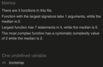
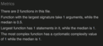
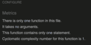
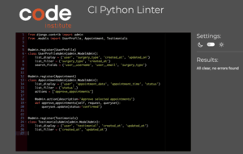
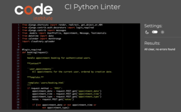
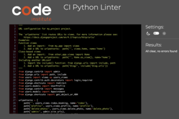
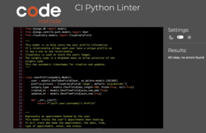

# Manual Testing

## User Authentication Testing

### Registration Validation
| Feature | Testing Performed | Result | Pass/Fail |
|---------|------------------|---------|-----------|
| Username Length (Valid) | Entered username "user23" | Username accepted and prompted for password | Pass |
| Duplicate Username | Tried to create account with existing username "user22" | Error: "A user with that username already exists" | Pass |
| Duplicate Email | Tried to register with existing email from user22 | Error: "A user is already registered with this email address" | Pass |
| Password Too Common | Used football team name as password | Error: "This password is too common" | Pass |
| Password Similar to Username | Used same password as username | Error: "The password is too similar to the username" | Pass |
| Password Too Short | Used password shorter than 8 characters | Error: "This password must contain at least 8 characters" | Pass |
| Valid Password | Entered password "password123" during registration | Password accepted | Pass |
| Email Mismatch | Entered different emails in both fields | Error: "You must type the same email each time" | Pass |
| Missing Second Email | Left second email field empty | Error: "Please fill in this field" | Pass |
| Incomplete Email | Entered "user23@" without domain | Error: "Please enter a part following '@'. 'email' is incomplete" | Pass |
| Successful Registration | Completed valid registration | Success message: "Successfully signed in" | Pass |

### Login Validation
| Feature | Testing Performed | Result | Pass/Fail |
|---------|------------------|---------|-----------|
| Valid Credentials | Entered existing username and password | Successfully logged in | Pass |
| Invalid Username | Entered non-existent username | Error message: "Incorrect username or password" | Pass |
| Invalid Password | Entered incorrect password for existing user | Error message: "Incorrect username or password" | Pass |
| Missing Fields | Submitted form with empty username/password | Form validation prevented submission | Pass |

### Authentication Flow
| Feature | Testing Performed | Result | Pass/Fail |
|---------|------------------|---------|-----------|
| Protected Route Access - Profile | Try to access profile page without login | Redirected to login page | Pass |
| Protected Route Access - Appointments | Try to access book appointment page without login | Redirected to login page | Pass |
| Protected Route Access - View Bookings | Try to access viewbooking page without login | Type Error at /view-booking/ | Fail |
| Protected Route Access - Contact | Try to access contact page without login | Redirected to login page | Pass |
| Public Route Access - Testimonials | Try to access testimonials page without login | Testimonial page shown | Pass |
| Protected Route Access - Appointments Dropdown | Try to access appointment dropdown without login | Redirected to login page | Pass |
| Post-Login Redirect | Check redirect after successful login | Redirected to homepage | Pass |
| Logout Functionality | Click logout button/link | Successfully logged out | Pass |
| Post-Logout Redirect | Check redirect after logout | Redirected to sign in page | Pass |

## Base Template Testing

### Navigation Bar Testing
| Feature | Testing Performed | Result | Pass/Fail |
|---------|------------------|---------|-----------|
| Logo Display | Check if Motus logo appears correctly | Logo displays as circular image with text | Pass |
| Brand Text | Verify "MOTUS Healthcare" text | Brand text displays correctly | Pass |
| Fixed Positioning | Check if navbar stays at top when scrolling | Navbar remains fixed at top of viewport |Pass |
| Responsive Toggle | Test burger menu on mobile devices | Burger menu functions on mobile device | Pass |
| Active State Highlighting | Check if current page is highlighted | Current page navigation link not showing active state | Fail |
| Welcome Message with username Display | Check welcome message for logged in users | Welcome message appears with username in the navbar for all devices | Pass |
| Profile Picture Display | Verify profile picture shows in welcome message | Profile picture displays correctly if image added or shows font awesome icon if no image | Pass |
| Dropdown Functionality | Test Appointments dropdown menu | Dropdown opens and shows Book/View options | Pass |
| Authentication Links | Check Register/Login links when logged out | Authentication links display correctly | Pass |
| Logout Link | Verify logout link when logged in | Logout link appears for authenticated users | Pass |

### Admin User Navigation Testing
| Feature | Testing Performed | Result | Pass/Fail |
|---------|------------------|---------|-----------|
| Admin Navigation Items | Login as admin user and check navbar | Only Profile, Contact, Therapist Dashboard, Logout visible | Pass |
| Regular User Navigation | Login as regular user and check navbar | All navigation items visible except Therapist Dashboard | Pass |

### Responsive Design Testing
| Feature | Testing Performed | Result | Pass/Fail |
|---------|------------------|---------|-----------|
| Mobile Layout | Test on mobile device or small viewport | Burger menu appears, navigation collapses | Pass |
| Tablet Layout | Test on tablet-sized viewport | Full navigation menu visible | Pass |
| Desktop Layout | Test on desktop viewport | Full navigation menu visible | Pass |

### Footer Testing
| Feature | Testing Performed | Result | Pass/Fail |
|---------|------------------|---------|-----------|
| Copyright Text | Verify copyright information displays | "© 2025 Motus Healthcare. All rights reserved." shows | Pass |
| Social Media Links | Check social media icons and links | Facebook, X, Instagram icons display | Pass |
| Social Link Functionality | Test social media link clicks | Links open in new tab to social platforms |  Pass |
| Footer Positioning | Check if footer stays at bottom | Footer positioned at bottom of page | Pass |

## Homepage Testing (index.html)

### Booking Form Testing
| Feature | Testing Performed | Result | Pass/Fail |
|---------|------------------|---------|-----------|
| Date Field | Click on date field | Date picker opens | Pass |
| Time Field | Click on time field | Unable to select time | Fail |
| Appointment Type | Click dropdown | Shows Initial Consultation and Follow Up | Pass |
| Notes Field | Type in textarea | Accepts text input | Pass |
| Form Submission | Submit with valid data | Success modal appears | Pass |
| Form Submission With Errors | Submit with missing data | Shows validation messages | Pass |
| Modal Dismissal | Close modal | Modal closes properly | Pass |

## Profile Page Testing (profile.html)

### Profile Image Testing
| Feature | Testing Performed | Result | Pass/Fail |
|---------|------------------|---------|-----------|
| Default Image Display | Check if default user icon shows when no photo | Default user icon displays correctly | Pass |
| Image Upload | Click "Upload Image" button and select file | File picker opens and allows image selection | Pass |
| Image Display | After upload, check if image appears | Uploaded image displays correctly | Pass |
| Change Photo | Click "Change Photo" button | File picker opens for new image | Pass |
| Delete Photo | Click "Delete Photo" button | Confirmation dialog appears |  Pass |
| Image Responsiveness | Check image on different screen sizes | Image scales properly across devices | Pass |

### Surgery Type Testing
| Feature | Testing Performed | Result | Pass/Fail |
|---------|------------------|---------|-----------|
| Surgery Type Display | Check if current surgery type shows | Surgery type displays or "Please Select" shows | Pass |
| Edit Surgery Type | Click "Change" or "Please Select" button | Surgery type dropdown appears | Pass |
| Dropdown Options | Check all surgery type options | All options display correctly | Pass |
| Save Surgery Type | Select type and click Save | Surgery type saves and displays | Pass |
| Cancel Edit Surgery | Click Cancel button | Returns to display mode without saving | Pass |
| Cancel Delete Photo | Click Cancel button | Returns to display mode without saving | Pass |
| Cancel Edit Photo | Click Cancel button | Returns to display mode without saving | Pass |

### Appointments Display Testing
| Feature | Testing Performed | Result | Pass/Fail |
|---------|------------------|---------|-----------|
| Confirmed Appointments | Check if confirmed appointments show | Confirmed appointments display in list | Pass |
| Appointment Details | Shows appointment details date and time | All appointment details show correctly | Pass |
| Appointment Status | Check status of appointment | Status displays confirmed | Pass |
| No Appointments Message | Check message when no appointments | "No confirmed appointments yet" message shows | Pass |
| Edit Appointment | Click Edit button on appointment | Edit dropdown opens with form | Pass |
| Delete Appointment | Click Delete button on appointment | Delete confirmation works | Pass |
| Delete Appointment Warning | Click Delete button on appointment | Bootstrap modal shows confirmation warning | Pass |
| Delete Appointment Confirmation | Click "Delete Appointment" in modal | Appointment is deleted successfully | Pass |
| Edit Appointment Approval | Edit appointment date/time and submit | Success message shows "Changes require admin approval" | Pass |
| Pending Status Update | Check appointment status after edit | Status changes to "pending" in view_bookings page | Pass |
| 24-Hour Notice Warning | Check warning message on profile page | Warning about 24-hour notice and admin approval shows | Pass |
| 24-Hour Notice Warning | Check warning message on view_booking page | Warning about 24-hour notice and admin approval shows | Pass |

## Appointments Pages Testing

### Booking Page Testing (booking.html)
| Feature | Testing Performed | Result | Pass/Fail |
|---------|------------------|---------|-----------|
| Date Field | Click on date field | Date picker opens and allows date selection | Pass |
| Time Field | Click on time field | Time picker opens and allows time selection | Pass |
| Appointment Type Dropdown | Click dropdown | Shows Initial Consultation and Follow Up options | Pass |
| Notes Field | Type in textarea | Accepts text input | Pass |
| Form Submission Valid | Submit with all required fields | Success message appears and redirects to booking page | Pass |
| Time Slot Already Booked | Try to book existing date/time | Error message shows "This time slot is already booked" | Pass |

### View Booking Page Testing (view_booking.html)
| Feature | Testing Performed | Result | Pass/Fail |
|---------|------------------|---------|-----------|
| Calendar Display | Check if calendar shows current month | Calendar displays with correct month/year | Pass |
| Month Navigation | Click left/right arrows | Calendar changes to previous/next month | Pass |
| Free Day Display | Check unbooked days | Shows "Free" on calendar days | Pass |
| Booked Day Display | Check booked days | Shows "Booked" with appointment time | Pass |
| Click Free Day | Click on day marked "Free" | Redirects to booking page | Pass |
| Click Booked Day | Click on day marked "Booked" | Modal warning shows "This day is already booked" | Pass |
| Booked Day Modal | Click "OK" on booked day modal | Modal closes and returns to calendar | Pass |
| Appointment List | Check if appointments show below calendar | All appointments display with details | Pass |
| Edit Appointment | Click Edit button on appointment | Edit dropdown opens with form | Pass |
| Delete Appointment | Click Delete button on appointment | Delete confirmation modal appears | Pass |
| Calendar Responsive | Test calendar on mobile/tablet | Calendar adapts to different screen sizes | Pass |

## Contact Page Testing (message_practitioner.html)

### Message Form Testing
| Feature | Testing Performed | Result | Pass/Fail |
|---------|------------------|---------|-----------|
| Subject Field | Type in subject field | Accepts text input | Pass |
| Message Field | Type in message textarea | Accepts multi-line text input | Pass |
| Form Submission Valid | Submit with subject and message | Success message shows "Your message has been sent to the practitioner!" | Pass |
| Form Submission Invalid | Submit with missing subject | Error message shows "Please fill in all required fields" | Pass |
| Form Submission Invalid | Submit with missing message | Error message shows "Please fill in all required fields" | Pass |
| Form Reset | After successful submission | Form clears and shows success message | Pass |
| Required Field Validation | Try to submit empty form | Form prevents submission and shows validation | Pass |
| Message Display | Check if sent messages show | User messages display with subject and content | Pass |
| Message Timestamp | Check message creation time | Timestamp shows | Pass |
| Message Ordering | Check message order | Messages ordered by newest first | Pass |
| Reply Display | Check if practitioner replies show | Replies display with different styling | Pass |
| Reply Icon | Check reply icon display | Reply icon shows for practitioner messages | Pass |
| Message Styling | Check message styling | User messages blue, replies light background | Pass |

### Message Management Testing
| Feature | Testing Performed | Result | Pass/Fail |
|---------|------------------|---------|-----------|
| Delete User Message | Click Delete on own message | Message is deleted and removed from list | Pass |
| Delete Success Message | Check after deletion | Success message shows "Message deleted successfully" | Pass |
| No Messages Display | Check when no messages | Shows no messages yet | Pass |
| Message Replies | Check if replies show under original | Replies display nested under original message | Pass |

## Testimonials Page Testing (testimonials.html)

### Testimonial Form Testing
| Feature | Testing Performed | Result | Pass/Fail |
|---------|------------------|---------|-----------|
| Form Display | Check if form shows for logged in users | Form displays for authenticated users | Pass |
| Form Hidden | Check if form shows for guests | Form hidden for non-authenticated users | Pass |
| Testimonial Field | Type in testimonial textarea | Accepts multi-line text input | Pass |
| Form Submission Valid | Submit with testimonial text | Success message shows "Thank you! Your testimonial has been added" | Pass |
| Form Submission Invalid | Submit empty form | Form prevents submission | Pass |
| Form Reset | After successful submission | Form clears and shows success message | Pass |
| Required Field Validation | Try to submit empty form | Form prevents submission | Pass |

### Testimonials Display Testing
| Feature | Testing Performed | Result | Pass/Fail |
|---------|------------------|---------|-----------|
| Testimonials List | Check if testimonials show | All testimonials display in list | Pass |
| Testimonial Content | Check testimonial text display | Testimonial text shows in quotes | Pass |
| User Attribution | Check username display | Username shows as "- username" | Pass |
| Timestamp Display | Check creation time | Timestamp shows | Pass |
| Testimonial Ordering | Check testimonial order | Testimonials ordered by newest first | Pass |
| No Testimonials | Check when no testimonials | Shows "No testimonials yet" message | Pass |

### Testimonial Management Testing
| Feature | Testing Performed | Result | Pass/Fail |
|---------|------------------|---------|-----------|
| Delete Own Testimonial | Click Delete on own testimonial | Testimonial is deleted and removed | Pass |
| Delete Other Testimonial | Check delete button visibility | Delete button only shows for own testimonials | Pass |
| Delete Success Message | Check after deletion | Success message shows "Testimonial deleted" | Pass |
| Delete Button Visibility | Check delete button for different users | Delete button only visible to testimonial author | Pass |
| Form Submission Valid | Submit with testimonial text | Success message shows "Thank you! Your testimonial has been added" | Pass |

## Therapist Dashboard Testing (therapist_dashboard.html)

### Appointments Section Testing
| Feature | Testing Performed | Result | Pass/Fail |
|---------|------------------|---------|-----------|
| Appointments Display | Check if all appointments show | All appointments display with user details | Pass |
| Appointment Details | Check appointment information display | Shows username, date, time, type, and status | Pass |
| Appointment Ordering | Check appointment order | Appointments ordered by newest first | Pass |
| Appointment Count | Check number of appointments shown | All appointments in system are displayed | Pass |

### Messages Section Testing
| Feature | Testing Performed | Result | Pass/Fail |
|---------|------------------|---------|-----------|
| Messages Display | Check if unread messages show | Only messages needing replies are displayed | Pass |
| Message Details | Check message information display | Shows username, subject, date and message | Pass |
| Message Ordering | Check message order | Messages ordered by newest first | Pass |
| No Messages | Check when no messages exist | Shows "No messages found" message | Pass |
| Reply Form Display | Check if reply form shows for each message | Reply form appears under each message | Pass |

### Reply Functionality Testing
| Feature | Testing Performed | Result | Pass/Fail |
|---------|------------------|---------|-----------|
| Reply Form Input | Type in reply message field | Accepts text input | Pass |
| Reply Form Submission | Submit reply with message | Reply is sent and success message shows | Pass |
| Reply Form Validation | Submit empty reply form | Form prevents submission (required field) | Pass |
| Message Status Update | Check if original message status updates | Original message marked as replied | Pass |
| Reply Redirect | Check after reply submission | Redirects back to therapist dashboard | Pass |

### Bug fixes
| Feature | Testing Performed | Result | Pass/Fail |
|---------|------------------|---------|-----------|
| Protected Route Access - View Bookings | Try to access viewbooking page without login | Type Error at /view-booking/ | Pass |
| Active State Highlighting | Check if current page is highlighted | Current page navigation showing active state | Pass |
| Time Field | Click on time field | Time picker opens | Pass |

Fix:
When logged out i clicked on the view-bookings page and it came up with the following error: TypeError at /view-booking/
Field 'id' expected a number but got <SimpleLazyObject: <django.contrib.auth.models.AnonymousUser object at 0x107d73980>>.

This was fixed by adding @login required for the booking_calendar_view function in the views.py.

No CSS styles applied for active nav bar link. Added this to underline in white when page is active.

time input in the appointment booking form did not allow input. Checked code in index.html and its inputtype was date and not time. This worked after chaning this.

## Validation checks

### Validation Check for JavaScript Files using JSHint

I used [JSHint](https://jshint.com/) to validate my JavaScript code.
The following adjustments were made:

#### **click_appointment.js** - Calendar Interaction Logic

**Issues Fixed:**
- ES6 compatibility warnings - Added `/* jshint esversion: 6 */` to enable ES6 features

---

#### **date_valid.js** - Date Validation Logic

**Issues Fixed:**
- ES6 compatibility warnings - Added `/* jshint esversion: 6 */` to enable ES6 features

---

#### **timepicker.js** - Time Selection Logic

**Issues Fixed:**
- ES6 compatibility warnings - Added `/* jshint esversion: 6 */` to enable ES6 features

---

### Validation Check for Python Files using CI Python Linter

### PEP8 Compliance Summary

I used the [CI Python Linter](https://pep8ci.herokuapp.com/) and followed the [PEP8 guidelines](https://peps.python.org/pep-0008/) to validate my code.

The following adjustments were made:

1. **Removed unnecessary blank lines and trailing whitespace** - Cleaned up formatting throughout all files.
2. **Ensured line length compliance** - All lines are under 79 characters, with docstring lines limited to 72 characters as recommended.
3. **Grouped imports in the correct order**:
   - Standard library imports
   - Related third-party imports  
   - Local application imports

#### **admin.py** - Django Admin Configuration

**Issues Fixed:**
- Line length violations (E501) - Broke down long lines to stay under 79 characters
- Trailing whitespace (W291) - Removed trailing spaces from lines
- Blank lines with whitespace (W293) - Cleaned up whitespace in blank lines
- Proper indentation - Fixed inconsistent indentation throughout file

---

#### **views.py** - Django Views Logic

**Issues Fixed:**
- Line length violations (E501) - Broke down long lines to stay under 79 characters
- Trailing whitespace (W291) - Removed trailing spaces from multiple lines
- Blank lines with whitespace (W293) - Cleaned up whitespace in blank lines throughout file
- Indentation errors - Fixed improper indentation in multi-line statements
- Missing newline - Added newline at end of file

---

#### **urls.py** - URL Routing Configuration

**Issues Fixed:**
- Line length violations (E501) - Broke down long URL pattern definitions to stay under 79 characters
- Fixed URL patterns for:
  - delete-appointment
  - edit-appointment
  - contact
  - therapist-dashboard
  - reply-message
  - delete-message
  - testimonials
  - view-booking

---

#### **models.py** - Database Models

**Issues Fixed:**
- Line length violations (E501) - Broke down long field definitions to stay under 79 characters
- Trailing whitespace (W291) - Removed trailing spaces from lines
- Blank lines with whitespace (W293) - Cleaned up whitespace in blank lines